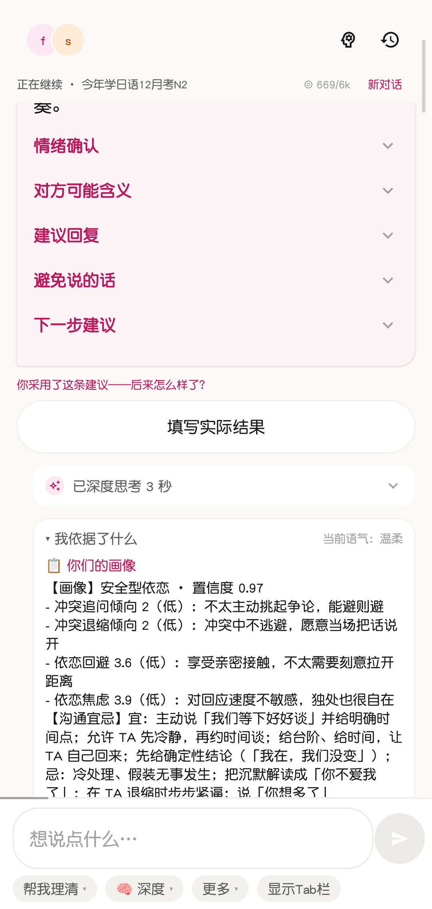
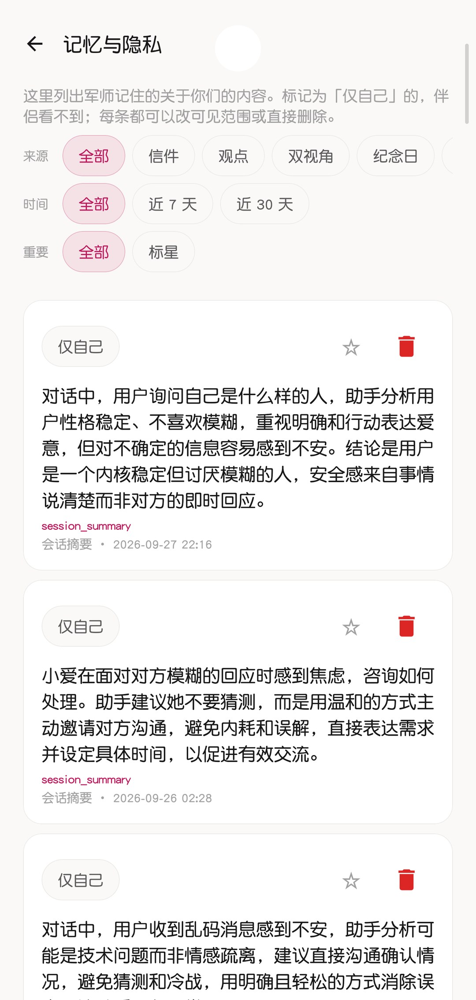
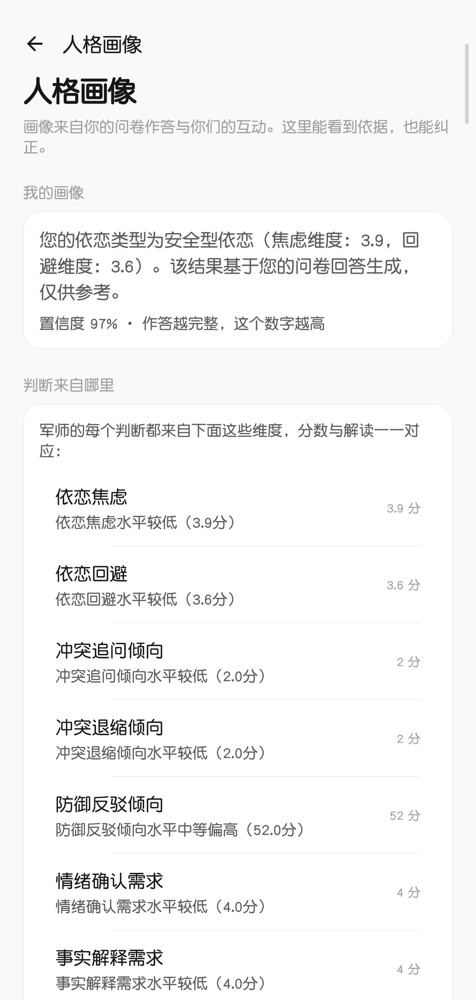
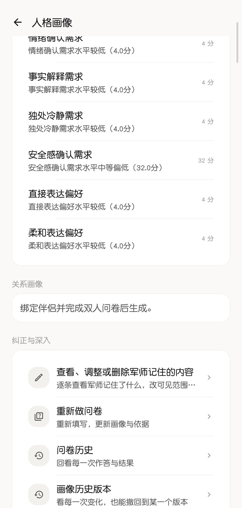
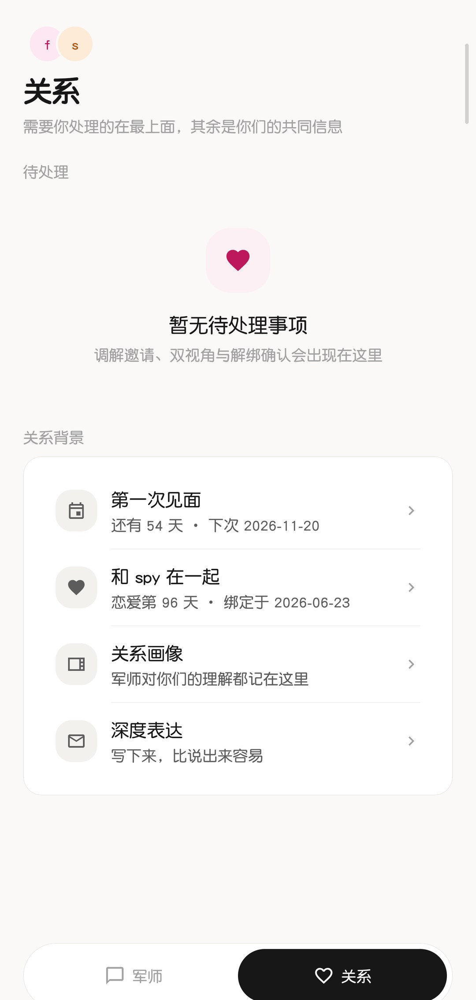
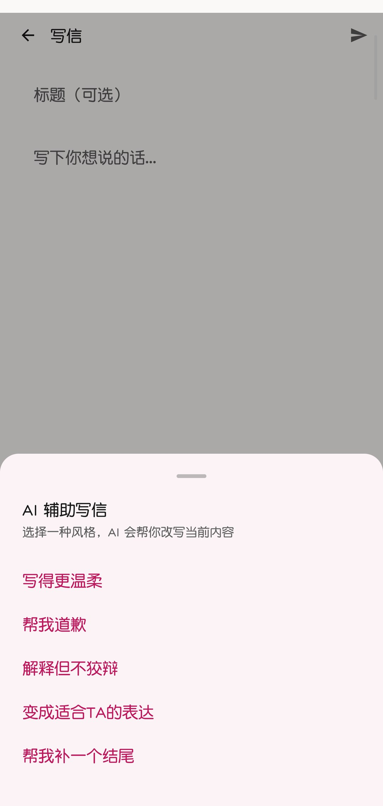
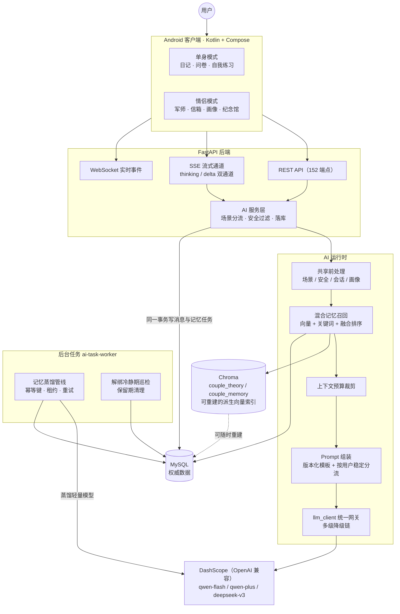
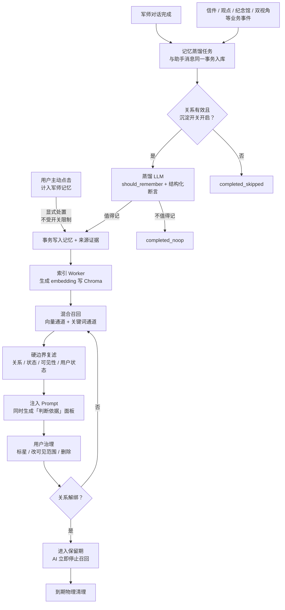

# Slowly慢慢说 · Couple AI Translator

> 把伴侣说的一句话，用 AI「翻译」成他真正想表达的意思，并告诉你该怎么回。

一个完整的双端产品：Android 客户端（Kotlin + Compose）+ Python 后端（FastAPI），
AI 链路全部接入真实大模型，已容器化部署在线运行。
核心是一套**有记忆、可解释、可治理**的 AI 军师系统——它记得你们的关系，
每个判断能说清「依据是什么」，每条记忆用户都能查看、限制范围或删除。

| | 实测值 |
|---|---|
| 客户端 | 223 个 Kotlin 文件 / 46,000 行 |
| 后端 | 174 个 Python 文件 / 29,400 行 |
| 接口 | 152 个 REST 端点 + SSE 流式 + WebSocket |
| 数据模型 | 49 个 ORM 模型，34 个 Alembic 迁移，单 head，可从空库一键重建 |
| 测试 | 77 个后端验证脚本 + 15 个 Android JVM 测试文件 |

---

## 目录

- [界面速览](#界面速览)
- [它是什么](#它是什么)
- [系统架构](#系统架构)
- [AI 军师：记忆是怎么转起来的](#ai-军师记忆是怎么转起来的)
- [几个值得一看的设计](#几个值得一看的设计)
- [技术栈](#技术栈)
- [功能模块](#功能模块)
- [快速开始](#快速开始)
- [项目结构](#项目结构)
- [测试](#测试)
- [部署](#部署)
- [已知边界](#已知边界)

---

## 界面速览

| 军师对话：结构化建议 + 可展开的判断依据 | 记忆与隐私：AI 记住的一切可查、可控、可删 |
|---|---|
|  |  |

| 人格画像：依恋类型 + 置信度 + 逐维解读 | 画像治理：记忆入口 / 问卷历史 / 版本回撤 |
|---|---|
|  |  |

| 关系主页：纪念日、在一起第 96 天 | 写信 AI 辅助：按语气改写，不代笔 |
|---|---|
|  |  |

---

## 它是什么

恋爱里的沟通问题，大多不是「不爱」，而是**说出来的话和想表达的意思对不上**。
这个 App 做两件事：把对方那句话翻译成他真实的需求，再告诉你此刻回什么话不致于把火拱起来。

两种模式，绑定情侣后无缝切换：

```
单身模式（未绑定）              情侣模式（已绑定）
  首页（我）/ 日记                我们 / 信箱 / 军师
  问卷、自我练习      ──绑定──▶   双视角、纪念馆、关系练习
  个人画像、绑定情侣  ◀──和离──   纪念日、愿望清单、AI 形象、调解室
```

「和离」是刻意的设计：单方面解不了绑，必须双方确认，中间留冷静期。

AI 的 **7 个场景**：私人军师、对方翻译、表达改写、冷战开解、信件解读、信件改写、信件回信。
每个场景一套独立 system prompt + 一个独立的 Pydantic 输出模型。

---

## 系统架构



要点：

- **MySQL 是唯一权威数据源**，Chroma 只保存可重建的派生向量——索引坏了可以随时重建，不丢数据。
- **API 进程绝不执行 LLM**：所有蒸馏任务由独立的 worker 进程领取执行，接口响应时间与模型解耦。
- 客户端与后端之间的字段契约有专门的对齐测试盯着（`test_client_dto_contract.py`）。

---

## AI 军师：记忆是怎么转起来的

军师不是无状态的问答机器人。它对你们关系的理解沉淀为一条条**原子记忆**，
每条记忆有来源、有证据、有可见范围，用户全程可控。



四条架构原则：

1. **召回必须复滤**。向量检索到的记忆，要再过一遍关系状态、记忆状态、可见性（仅自己 / 情侣共享）
   和查看者状态——先检索、后授权，权限边界不依赖召回质量。
2. **注入与解释同源**。注入 Prompt 的记忆和「判断依据」面板展示的记忆是同一份召回结果，
   军师说「我依据了什么」时，用户看到的就是模型真正看到的东西，没有第二套口径。
3. **写入是事务性的**。助手消息与蒸馏任务在同一事务入库；蒸馏产物（断言 + 证据）在同一事务提交；
   删除记忆时证据、关联边、用户状态在同一事务级联清理。
4. **流水线是持久化的**。蒸馏任务带幂等键落库，worker 租约领取、失败重试；
   执行前再次复查沉淀开关——用户刚关掉开关，已排队的任务会被丢弃而不是继续写。

---

## 几个值得一看的设计

### 1. 流式 AI：思考与正文双通道，且断开即止血

推理模型先产出一大段思考（实测最长 1.1 万字）再落笔正文，
如果都塞进同一条通道，用户会对着空白等十几秒。

服务端把 `thinking` 与 `delta` 拆成两个 SSE 事件：思考进「深度思考」折叠面板，
正文走打字机渲染，互不污染。配套解决三件事：

- **心跳 2 秒**：`stream_with_heartbeat` 持续发注释帧，同时它也是「客户端断开后服务端止损」的延迟上界
  —— Starlette 要等生成器走到 yield 点才会抛 `GeneratorExit`；
- **主动取消**：`llm_client.stream_events(..., cancel_event=)` 用 watcher 线程轮询，
  置位即 `resp.close()` 打断阻塞读，模型停止计费；
- **非阻塞**：SMTP、落库这类慢操作一律丢后台线程，不能卡住事件循环。

### 2. 一次调用同时拿到打字机正文与结构化字段

结构化输出走 Function Calling 承载 Pydantic schema——因为服务端**不支持 `json_schema`**。
但纯 tool_calls 拿不到打字机效果，于是做了双出口：

```
正文流式下发 ……  <<<STRUCTURED>>>  {"mood": "...", "advice": [...]}
```

`structured_stream.py` 的分帧器会**扣住可能是分隔符前缀的尾部**，不会把半个标记吐给用户。
切分出的 JSON 再走 Pydantic 强校验；校验失败则降级为「约束重试 → prompt 内嵌 JSON」两级兜底。

### 3. 混合召回：向量通道挂了也不影响服务

长期记忆召回走**双通道**：Chroma 向量语义检索 + MySQL 关键词检索（短语 + 2-gram，不引中文分词依赖），
两路候选融合排序（相关度 + 时间 + 重要度 + 场景），再过硬边界复滤。
向量库不可用时关键词通道独立可用——检索是增强，不是单点。

### 4. Prompt 版本化与稳定分流

system prompt 存于 `ai_prompt_template` 表，支持多版本并存与按用户稳定分流（A/B 灰度）：
换提示词无需改代码发版，库里加一版并置 `active` 即可生效；多条 `active` 并存时按 `user_id` 取模**稳定**
分流——同一用户始终命中同一版本，体验不横跳、实验数据可比。
数据库不可用、场景无模板、查询异常、模板被写坏这四类情况一律**静默回退**代码内置文案，
prompt 组装不成为可用性故障点。

### 5. 画像可解释、可版本化

问卷画像的每个结论都带**置信度**，并逐维度给出分数与解读（见界面速览第三张图）。
画像修改走**版本化派生**：每次变更生成新版本，记录来源，可回撤到任意历史版本——
AI 的判断错了，用户能纠正，纠正过程本身可追溯。

### 6. 通知双通道，以及一条隐私红线

- **通道① 系统通知栏**：WebSocket 事件 → `NotificationManager`。零第三方 SDK、零远程依赖。
- **通道② 邮件**（用户主动开启，默认关闭）：App 进程被杀后仍然能收到。

邮件正文**不含任何业务内容**——不带信件标题、正文、对方昵称，只说「有人给你写了一封信」。
这条不是靠自觉，是靠签名收窄实现的：`send_push_notification(user_id, event_type)`
结构上就传不出内容，测试里有源码级断言盯着。同类事件 30 分钟冷却 + 24 小时上限。

### 7. 统一错误封装与可重建的数据库

业务错误一律 `HTTP 200 + {code, message, data}`，`message` 是可直接展示给用户的中文；
只有认证/权限失败才用 401 / 403，收口在 `main.py` 的异常处理器里，业务代码不写 try/except 样板。

34 个迁移全部写成**幂等**的（建表 / 加列前先判断存在性）——MySQL 不支持事务性 DDL，
所以幂等性比任何回滚机制都重要。`scripts/verify_migrations.py` 校验迁移链与 ORM 模型的差异应为 0。

---

## 技术栈

**后端**：Python 3.13 · FastAPI · SQLAlchemy 2.0 · Alembic · MySQL · JWT · LangChain 1.x · ChromaDB

**客户端**：Kotlin · Jetpack Compose · Material 3 · Hilt · Retrofit / OkHttp / Moshi · Navigation Compose · DataStore

**构建**：Gradle 8.9 · JDK 21 · compileSdk 35 · minSdk 26

**AI**：阿里云百炼 DashScope（OpenAI 兼容端点）。主模型 `qwen3.7-flash`（推理模型，先产出思考再落笔正文），
降级链 `qwen-plus → deepseek-v3 → qwen-turbo`，记忆蒸馏等后台轻量任务专用 `qwen-turbo`，
embedding 用 `text-embedding-v4`（1024 维）。

---

## 功能模块

| 层 | 模块 |
|----|------|
| 基础 | 用户认证、个人资料、情侣绑定 / 解绑 |
| 画像 | 心理问卷（11 维度）、依恋类型判定、个人画像、情侣组合画像、画像版本化 |
| AI 军师 | 7 场景对话、混合记忆召回、记忆蒸馏管线、判断依据面板、记忆与隐私管理 |
| 沟通 | 情侣邮箱（写信 / 收信 / 草稿 / AI 辅助）、双人调解室 |
| 沉淀 | 双视角记录、关系纪念馆、关系练习、纪念日、愿望清单、观点（日记） |
| 体验 | AI 形象（捏脸 / 换装）、远程陪伴、情侣空间首页 |
| 安全 | 输入输出双向过滤、邮件通知隐私收窄、解绑冷静期与记忆保留期 |

---

## 快速开始

### 方式一：Docker Compose（推荐）

```bash
cp .env.example .env
# 至少要填 JWT_SECRET 与 AI_API_KEY

docker compose --profile local-db up -d --build
```

首次启动会自动完成：跑 Alembic 迁移 → 灌种子数据（问卷 / AI 场景 / 情侣理论语料 / 练习 / 头像素材）
→ 构建向量库 → 起服务。

```bash
curl -s localhost:8000/openapi.json | python -c "import sys,json;print('paths:',len(json.load(sys.stdin)['paths']))"
```

接口文档：<http://localhost:8000/docs>

> 已有自己的 MySQL？在 `.env` 里设 `DB_URL`（宿主地址用 `host.docker.internal`），
> 然后 `docker compose up -d --build`，不要加 `--profile local-db`。

### 方式二：本地直跑后端

```bash
cd backend
python -m venv .venv
source .venv/Scripts/activate        # Windows Git Bash；macOS/Linux 用 .venv/bin/activate
pip install -r requirements.txt

cp .env.example .env                 # 填 DB_URL / JWT_SECRET / AI_API_KEY
python -m alembic upgrade head

# 灌种子数据（脚本幂等，重复执行安全）
for s in seed_questionnaire seed_ai_scenes seed_knowledge seed_self_practices seed_avatar_assets; do
  python "scripts/$s.py"
done
python scripts/build_vectorstore.py   # 首次构建向量库（需要 AI_API_KEY 调 embedding）
python scripts/build_memory_index.py  # 可选：重建长期记忆向量索引

python main.py                        # http://127.0.0.1:8000/docs
```

> 忘了邮箱 SMTP 配置也能跑起来：注册只要求邮箱 + 密码，不校验验证码。
> 只有「忘记密码」和「邮件通知」需要 SMTP；本地联调时把 `EMAIL_DEV_MODE=true`
> 即可在不开 SMTP 的情况下走通验证码流程（⚠️ 生产必须保持 `false`）。

### 客户端

需要 JDK 21 与 Android SDK（compileSdk 35）。

```bash
cd android
./gradlew :app:assembleDebug        # 产物：app/build/outputs/apk/debug/app-debug.apk
./gradlew :app:installDebug         # 装到已连接的设备
```

后端地址在 `core/.../network/NetworkModule.kt` 的 `DEFAULT_BASE_URL`，
默认指向线上 `http://182.92.194.78:8000/`；本地调试改成 `http://<你的内网IP>:8000/`
（设备上用 `127.0.0.1` 会指向手机自己）。

---

## 项目结构

```
backend/
  app/
    api/v1/          common（认证/用户） · couple（情侣侧） · single（单身侧）
    services/        业务编排；AI 统一入口 llm_client.py，流式基建 sse.py，
                     记忆召回 memory_retrieval.py，蒸馏管线 pipeline
    repositories/    数据访问；service 不直接碰 db.query()
    models/ schemas/ ORM 模型与 Pydantic 出入参（含 AI 输出模型）
    tasks/           后台任务（解绑冷静期巡检）
  alembic/versions/  34 个迁移，单 head
  tests/             77 个可执行验证脚本
  scripts/           seed_* / build_vectorstore / build_memory_index / verify_migrations

android/
  core/              跨模式共享：网络、主题、通用组件、设置页、通知
  feature/couple/    情侣模式：首页、信箱、军师、调解室、纪念馆、双视角……
  feature/single/    单身模式：日记、自我练习
  app/               壳层：MainActivity → NavGraph → CoupleShell / SingleShell
```

壳层只有一个：`MainActivity → NavGraph → CoupleShell(feature:couple) / SingleShell(feature:single)`。

---

## 测试

后端是**可执行脚本**而非 pytest（便于单跑、便于留档），77 个脚本按主题分片：

```bash
cd backend

# 开箱即跑（SQLite 内存库，不需要 MySQL / SMTP / API Key）
python tests/test_email_notify.py        # 邮件通道
python tests/test_forgot_password.py     # 忘记密码
python tests/test_safety_hardening.py    # 安全加固

# 需要可用数据库
python tests/test_endpoint_smoke.py      # 112 项端到端冒烟，断言无 5xx
python tests/test_api_contract.py        # 接口出入参契约
python tests/test_client_dto_contract.py # 后端字段 ↔ 客户端 DTO 对齐
python tests/test_error_envelope.py      # 错误封装一致性
python tests/test_sse.py                 # SSE 帧协议
python tests/verify_migration_scratch.py # 从空库跑全量迁移

# 记忆系统（本项目最重的测试面，20+ 个脚本）
python tests/test_memory_hybrid.py       # 混合召回
python tests/test_memory_distill.py      # 蒸馏管线
python tests/test_memory_dualwrite_parity.py  # 双写一致性
python tests/test_memory_pipeline_idempotency.py  # 幂等与重试
python tests/test_memory_access.py       # 可见性 / 权限复滤

python scripts/verify_migrations.py      # 迁移链与 ORM 模型差异校验
```

Android 侧是 15 个纯 JVM 测试文件，覆盖不依赖 Android 框架的纯函数：

```bash
cd android
./gradlew :core:testDebugUnitTest :feature:couple:testDebugUnitTest
```

- `SseFramesTest` — SSE 行解析：心跳注释必须丢弃、多行 `data` 要攒齐、残帧不派发
- `GenerationStreamTest` — SSE 帧 → 业务事件解码，以及「错误码 → 用户文案」映射
- `UrlsTest` — 相对路径 → 绝对 URL 拼接
- `RealtimeNoticeTest` — 实时事件 → Snackbar / 通知 的唯一映射表

---

## 部署

`docker-compose.yml` 起后端 +（可选）MySQL，向量库与上传目录走命名卷，重建镜像不丢数据。

```bash
# 服务器上
cd <部署目录>
docker compose up -d --build
docker compose exec backend python scripts/verify_migrations.py   # 校验迁移链
```

容器镜像里 `langchain 1.x` 与 `chromadb` 都要求 Python ≥ 3.9，
而目标服务器系统自带 Python 3.8——这正是选择容器化的直接原因：把 Python 版本这一层隔离掉。

---

## 已知边界

**如实列出，不打算藏**：

| 边界 | 说明 |
|---|---|
| 无第三方推送 SDK | App 进程被杀后收不到实时事件。厂商通道需上架才有，对个人项目收益为零；邮件通道是可用的补位（需用户开启）。 |
| 无 HTTPS | 客户端 `BASE_URL` 是明文 HTTP。未做域名备案，token 与信件内容在公网裸传，仅作个人演示用。 |
| 无 CI | 测试脚本靠手动跑，没有流水线。 |
| Android 测试只覆盖纯函数 | 15 个 JVM 测试文件，没有 UI 测试（Compose UI 测试需要设备/模拟器）。 |
| 记忆系统处于灰度阶段 | 新版断言采用双写：写入已切换，默认读取仍是 legacy 路径，读取切换由功能开关控制、尚未全量。 |
| CORS `allow_origins=["*"]` | 后端主要服务原生客户端，未收紧。 |
| 部署靠手动 | `deploy/` 下打包 → 上传 → 重建 → 重启共 4 个脚本需依次执行，没有自动化流水线。 |

---

## 备注

界面截图为真机实拍（`docs/screenshots/`）。开发过程中的中文设计文档（项目现状报告、
实现与设计对比报告等）仅保留在本地，未纳入本仓库——它们记录的是某一时刻的核对结果，
对外说明以本 README 为准。
